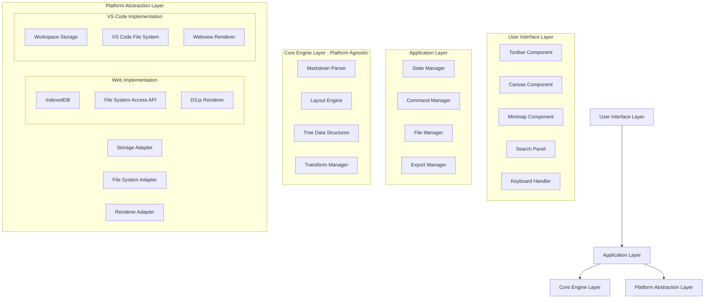
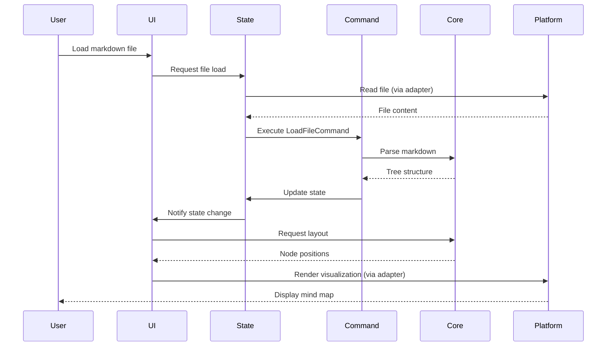
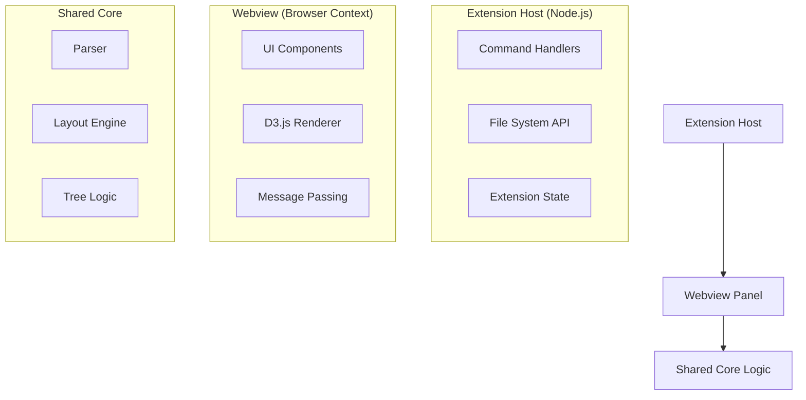

# Design Document: Markdown to Mind Map Generator

## Overview

The Markdown to Mind Map Generator is a web-based visualization tool that transforms markdown documents into interactive mind maps. Built as a fork of the Markmap library, it extends the base functionality with professional features including file persistence, multiple layout algorithms, advanced navigation controls, keyboard shortcuts, undo/redo capabilities, and search functionality.

### Design Goals

1. **Local-First Architecture**: No server dependencies, all operations run client-side
2. **Performance**: Maintain 60fps rendering for mind maps with up to 1000 nodes
3. **Extensibility**: Clean separation of concerns to enable future feature additions
4. **Professional UX**: Comprehensive keyboard shortcuts, undo/redo, auto-save, and recovery
5. **Desktop-Optimized**: Target desktop browsers (Chrome, Firefox, Safari, Edge) with no mobile support
6. **Platform Portability**: Architecture designed to support both web application and VS Code extension deployment with shared core logic

### Technology Stack

**Core Framework (Platform Agnostic)**
- Fork of Markmap (TypeScript + D3.js) - https://github.com/markmap/markmap
  - Reference implementation for D3.js patterns and SVG rendering
  - Custom parser replaces Markmap's markdown-it based parser
  - Custom layout algorithms replace Markmap's flextree layout
  - Not used as npm dependency - code extracted and customized
- Pure TypeScript for business logic
- No platform-specific dependencies in core modules

**Web Framework**
- Next.js 14+ with App Router for web application
- Server-side rendering and static generation capabilities
- Built-in API routes for future backend needs

**Styling & UI Components**
- Tailwind CSS for utility-first styling
- shadcn/ui for production-ready component library
- Consistent design system with theme customization

**Rendering Engine**
- D3.js v7 for SVG-based visualization
- Works in both browser and VS Code webview contexts

**State Management**
- Custom state manager with command pattern for undo/redo
- Platform-agnostic state logic

**Platform Adapters**
- Web: File System Access API, IndexedDB, LocalStorage
- VS Code: Extension API, Workspace State, File System API

**Testing**
- Jest for unit tests
- fast-check for property-based testing
- Platform-agnostic test suite runs on both targets

### Key Architectural Decisions

1. **Fork vs Wrapper**: Forking Markmap allows deep customization of layout algorithms and rendering pipeline
   - **Fork Source**: https://github.com/markmap/markmap
   - **Fork Strategy**: Extract core parsing and rendering logic, replace with custom implementations
   - **What We Keep**: D3.js integration patterns, SVG rendering approach, basic tree structure
   - **What We Replace**: Parser (custom indentation-based), layout algorithms (5 directions), state management (command pattern), file operations (platform adapters)
   - **Integration Approach**: Use Markmap as reference implementation, not as dependency
2. **Command Pattern**: All state-changing operations implemented as commands for undo/redo support
3. **Lazy Rendering**: Only render nodes visible in viewport for performance with large documents
4. **Local Storage**: Use IndexedDB for auto-save and recovery, File System Access API for explicit saves
5. **Modular Layout System**: Abstract layout algorithms into pluggable strategies
6. **Platform Abstraction**: Core logic separated from platform-specific APIs through adapter pattern, enabling deployment as both web app and VS Code extension

## Architecture

### Markmap Fork Strategy

This project is built as a conceptual fork of Markmap, meaning we use it as a reference implementation rather than a direct code fork or npm dependency.

**Markmap Repository**: https://github.com/markmap/markmap

**What We Learn From Markmap**:
- D3.js integration patterns for SVG mind map rendering
- Tree data structure approaches for hierarchical visualization
- Pan/zoom interaction patterns with D3
- SVG export techniques
- Color scheme application to branches

**What We Replace/Customize**:

1. **Parser** (Complete Replacement)
   - Markmap uses: markdown-it parser with plugins
   - We implement: Custom indentation-based parser (simpler, more predictable)
   - Reason: Direct control over parsing logic, no markdown-it dependency

2. **Layout Engine** (Complete Replacement)
   - Markmap uses: flextree algorithm (single layout)
   - We implement: 5 custom layout algorithms (two-sided, L-R, R-L, T-B, B-T)
   - Reason: Multiple layout directions, balanced distribution, custom spacing

3. **State Management** (New Addition)
   - Markmap: Minimal state, no undo/redo
   - We implement: Command pattern with full undo/redo support
   - Reason: Professional UX with state history

4. **File Operations** (New Addition)
   - Markmap: Browser-only, no file persistence
   - We implement: Platform adapters for web and VS Code
   - Reason: Multi-platform support, file save/load, auto-save

5. **Search Functionality** (New Addition)
   - Markmap: No search
   - We implement: Full-text search with navigation
   - Reason: Essential for large mind maps

6. **Keyboard Shortcuts** (New Addition)
   - Markmap: Basic interactions only
   - We implement: Comprehensive keyboard shortcuts
   - Reason: Power user productivity

**Integration Approach**:

```typescript
// We DO NOT install Markmap as dependency
// package.json will NOT include:
// "markmap-lib": "^x.x.x"  ❌

// Instead, we reference Markmap code patterns:
// 1. Study markmap-view for D3.js rendering patterns
// 2. Study markmap-lib for tree structure ideas
// 3. Implement our own versions with customizations

// Example: D3 rendering inspired by Markmap
class D3Renderer implements Renderer {
  // Pattern learned from markmap-view/src/view.ts
  // But implemented with our custom requirements
  render(root: TreeNode, positions: Map<string, Position>): void {
    // Our custom implementation
  }
}
```

**License Compliance**:
- Markmap is MIT licensed (permissive)
- We can study and learn from the code
- We implement our own versions (not copy-paste)
- We credit Markmap in documentation as inspiration
- No license conflicts with our implementation

**Development Workflow**:
1. Phase 1: Study Markmap source code for D3.js patterns
2. Phase 2: Implement our custom parser (no Markmap code)
3. Phase 3: Implement our custom layouts (inspired by Markmap's approach)
4. Phase 4: Implement our D3 renderer (using patterns from Markmap)
5. Phase 5: Add our custom features (state, file ops, search, etc.)

### High-Level Architecture



### Component Responsibilities

#### User Interface Layer

**Toolbar Component**
- Renders action buttons (save, load, export, layout selection)
- Displays file status indicators (saved/unsaved/saving)
- Provides expand/collapse/reset controls
- Manages export format selection

**Canvas Component**
- Hosts the D3.js SVG rendering surface
- Handles pan and zoom interactions
- Manages viewport transformations
- Implements lazy rendering for visible nodes only

**Minimap Component**
- Renders thumbnail overview of entire mind map
- Displays viewport indicator rectangle
- Handles click-to-navigate interactions
- Auto-hides for small mind maps (<100 nodes)

**Search Panel**
- Provides search input with real-time filtering
- Displays result count and navigation controls
- Highlights matching nodes in the visualization
- Supports case-sensitive/insensitive modes

**Keyboard Handler**
- Captures keyboard events at application level
- Maps key combinations to commands
- Prevents conflicts with browser shortcuts
- Displays shortcut reference modal

#### Application Layer

**State Manager**
- Maintains single source of truth for application state
- Implements observer pattern for reactive updates
- Manages state transitions atomically
- Provides state snapshots for undo/redo

**Command Manager**
- Implements command pattern for all state changes
- Maintains undo stack (50 operations) and redo stack
- Executes, undoes, and redoes commands
- Clears redo stack when new command executes

**File Manager**
- Handles file loading from File System Access API
- Manages file saving with auto-save scheduling
- Maintains recent files list (10 entries)
- Provides drag-and-drop file handling

**Export Manager**
- Generates HTML exports with embedded styles
- Creates SVG exports from D3 rendering
- Produces PNG/JPG rasters via canvas conversion
- Manages export progress and error handling

#### Core Engine Layer (Platform Agnostic)

**Markdown Parser**
- Parses markdown text into abstract syntax tree (AST)
- Detects indentation type (spaces vs tabs)
- Validates indentation consistency
- Converts AST to internal tree structure
- **Portability**: Pure TypeScript, no platform dependencies

**Layout Engine**
- Implements five layout algorithms (two-sided, L-R, R-L, T-B, B-T)
- Calculates node positions based on tree structure
- Ensures no node overlap with collision detection
- Optimizes layout for balanced visual distribution
- **Portability**: Pure computation, no DOM/browser dependencies

**Tree Data Structures**
- TreeNode, ApplicationState, Transform interfaces
- Command pattern implementations
- State management logic
- **Portability**: Pure TypeScript data structures

**Transform Manager**
- Manages pan and zoom transformations
- Implements smooth animation transitions
- Constrains zoom levels (10%-400%)
- Provides "fit to screen" calculations
- **Portability**: Math operations only, no rendering dependencies

#### Platform Abstraction Layer

This layer provides adapters that isolate platform-specific APIs from core logic, enabling the same codebase to run as both a web application and VS Code extension.

**Storage Adapter Interface**
```typescript
interface StorageAdapter {
  saveAutoSave(record: AutoSaveRecord): Promise<void>;
  loadAutoSave(): Promise<AutoSaveRecord | null>;
  clearAutoSave(): Promise<void>;
  savePreferences(prefs: UserPreferences): Promise<void>;
  loadPreferences(): Promise<UserPreferences>;
}
```

**Web Implementation**: Uses IndexedDB for auto-save, LocalStorage for preferences
**VS Code Implementation**: Uses workspace state API and global state API

**File System Adapter Interface**
```typescript
interface FileSystemAdapter {
  openFile(): Promise<{ content: string; path: string; handle?: any }>;
  saveFile(content: string, path?: string, handle?: any): Promise<void>;
  getRecentFiles(): Promise<string[]>;
  addRecentFile(path: string): Promise<void>;
}
```

**Web Implementation**: Uses File System Access API with download/upload fallback
**VS Code Implementation**: Uses VS Code workspace file system API

**Renderer Adapter Interface**
```typescript
interface RendererAdapter {
  initialize(container: HTMLElement): void;
  render(tree: TreeNode, positions: Map<string, Position>): void;
  update(changes: NodeChange[]): void;
  clear(): void;
  exportToSVG(): string;
  exportToPNG(background: 'transparent' | 'white'): Promise<Blob>;
}
```

**Web Implementation**: Direct D3.js rendering to DOM
**VS Code Implementation**: D3.js rendering within webview, with message passing for exports

### Data Flow



## Platform Portability Architecture

### Shared Core vs Platform-Specific Code

The architecture is designed to maximize code reuse between web and VS Code extension deployments:

**Shared Core (90% of codebase)**
- Markdown parser (pure TypeScript)
- Layout algorithms (pure computation)
- Tree data structures and state management
- Command pattern implementations
- Transform calculations
- Search algorithms
- Validation logic
- All business logic

**Platform-Specific (10% of codebase)**
- Storage implementation (IndexedDB vs VS Code state API)
- File system operations (File System Access API vs VS Code FS API)
- Rendering context (direct DOM vs webview)
- Keyboard shortcuts (browser events vs VS Code commands)
- Export mechanisms (download vs VS Code save dialog)

### VS Code Extension Architecture

When deployed as a VS Code extension, the application uses the following architecture:



**Extension Host Responsibilities**
- Register VS Code commands (e.g., `mindmap.open`, `mindmap.export`)
- Handle file system operations using VS Code APIs
- Manage extension state and preferences
- Create and manage webview panels
- Handle message passing between extension and webview

**Webview Responsibilities**
- Render UI using shared components
- Execute shared core logic (parser, layout, state)
- Render mind map using D3.js
- Send messages to extension host for file operations
- Receive messages from extension host with file content

**Message Passing Protocol**
```typescript
// Extension → Webview messages
type ExtensionMessage =
  | { type: 'loadFile'; content: string; path: string }
  | { type: 'saveComplete'; success: boolean }
  | { type: 'exportComplete'; success: boolean };

// Webview → Extension messages
type WebviewMessage =
  | { type: 'requestSave'; content: string; path?: string }
  | { type: 'requestExport'; format: ExportFormat; data: string }
  | { type: 'requestOpenFile' }
  | { type: 'updateState'; state: Partial<ApplicationState> };
```

### Platform Adapter Implementations

**Web Platform Adapter**
```typescript
class WebStorageAdapter implements StorageAdapter {
  private db: IDBDatabase;
  
  async saveAutoSave(record: AutoSaveRecord): Promise<void> {
    // Use IndexedDB
    const tx = this.db.transaction('autosave', 'readwrite');
    await tx.objectStore('autosave').put(record);
  }
  
  async loadPreferences(): Promise<UserPreferences> {
    // Use LocalStorage
    const json = localStorage.getItem('preferences');
    return json ? JSON.parse(json) : defaultPreferences;
  }
}

class WebFileSystemAdapter implements FileSystemAdapter {
  async openFile(): Promise<{ content: string; path: string; handle?: any }> {
    // Use File System Access API with fallback
    if ('showOpenFilePicker' in window) {
      const [handle] = await window.showOpenFilePicker({
        types: [{ description: 'Markdown', accept: { 'text/markdown': ['.md'] } }]
      });
      const file = await handle.getFile();
      const content = await file.text();
      return { content, path: file.name, handle };
    } else {
      // Fallback: file input element
      return this.openFileWithInput();
    }
  }
}
```

**VS Code Platform Adapter**
```typescript
class VSCodeStorageAdapter implements StorageAdapter {
  constructor(private context: vscode.ExtensionContext) {}
  
  async saveAutoSave(record: AutoSaveRecord): Promise<void> {
    // Use workspace state
    await this.context.workspaceState.update('autosave', record);
  }
  
  async loadPreferences(): Promise<UserPreferences> {
    // Use global state
    const prefs = this.context.globalState.get<UserPreferences>('preferences');
    return prefs || defaultPreferences;
  }
}

class VSCodeFileSystemAdapter implements FileSystemAdapter {
  async openFile(): Promise<{ content: string; path: string }> {
    // Use VS Code file picker
    const uris = await vscode.window.showOpenDialog({
      canSelectMany: false,
      filters: { 'Markdown': ['md'] }
    });
    
    if (!uris || uris.length === 0) {
      throw new Error('No file selected');
    }
    
    const uri = uris[0];
    const content = await vscode.workspace.fs.readFile(uri);
    return {
      content: Buffer.from(content).toString('utf8'),
      path: uri.fsPath
    };
  }
  
  async saveFile(content: string, path?: string): Promise<void> {
    let uri: vscode.Uri;
    
    if (path) {
      uri = vscode.Uri.file(path);
    } else {
      const result = await vscode.window.showSaveDialog({
        filters: { 'Markdown': ['md'] }
      });
      if (!result) throw new Error('Save cancelled');
      uri = result;
    }
    
    await vscode.workspace.fs.writeFile(uri, Buffer.from(content, 'utf8'));
  }
}
```

### Deployment Configurations

**Web Application**
- Single-page application built with Vite
- Deployed as static files (HTML, CSS, JS)
- No server-side dependencies
- Runs entirely in browser

**VS Code Extension**
- Extension manifest (package.json) with activation events
- Extension entry point (extension.ts) registers commands
- Webview HTML bundles shared core + UI components
- Published to VS Code Marketplace

**Build Configuration**
```typescript
// next.config.js - Next.js configuration
export default {
  reactStrictMode: true,
  swcMinify: true,
  // Optimize for D3.js and large datasets
  webpack: (config) => {
    config.optimization.minimize = true;
    return config;
  }
};

// tailwind.config.ts - Tailwind CSS configuration
export default {
  content: [
    './src/app/**/*.{js,ts,jsx,tsx}',
    './src/components/**/*.{js,ts,jsx,tsx}',
  ],
  theme: {
    extend: {
      // Custom theme for mind map visualization
    },
  },
  plugins: [],
};

// next.config.webview.js - VS Code webview build (separate)
// Uses Next.js export for static generation
export default {
  output: 'export',
  distDir: 'dist/webview',
};
```

### Migration Path

The architecture supports incremental migration:

1. **Phase 1**: Build web application with platform abstraction layer
2. **Phase 2**: Implement VS Code adapters (storage, file system, renderer)
3. **Phase 3**: Create VS Code extension host and webview integration
4. **Phase 4**: Test and publish VS Code extension

The shared core remains unchanged across phases, ensuring consistency and reducing maintenance burden.

## Components and Interfaces

### Project Structure

The codebase is organized to maximize code sharing between web and VS Code deployments:

```
src/
├── core/                      # Platform-agnostic core (shared)
│   ├── parser/
│   │   ├── markdown-parser.ts
│   │   ├── tree-builder.ts
│   │   └── validator.ts
│   ├── layout/
│   │   ├── layout-engine.ts
│   │   ├── two-sided-layout.ts
│   │   ├── directional-layouts.ts
│   │   └── collision-detection.ts
│   ├── state/
│   │   ├── state-manager.ts
│   │   ├── command-manager.ts
│   │   └── commands/
│   ├── transform/
│   │   ├── transform-manager.ts
│   │   └── viewport-calculator.ts
│   ├── search/
│   │   └── search-engine.ts
│   └── types/
│       ├── tree-node.ts
│       ├── application-state.ts
│       └── interfaces.ts
│
├── platform/                  # Platform abstraction layer
│   ├── adapters/
│   │   ├── storage-adapter.ts      # Interface
│   │   ├── filesystem-adapter.ts   # Interface
│   │   └── renderer-adapter.ts     # Interface
│   ├── web/                        # Web implementations
│   │   ├── web-storage-adapter.ts
│   │   ├── web-filesystem-adapter.ts
│   │   └── web-renderer-adapter.ts
│   └── vscode/                     # VS Code implementations
│       ├── vscode-storage-adapter.ts
│       ├── vscode-filesystem-adapter.ts
│       └── vscode-renderer-adapter.ts
│
├── components/                # UI components (shadcn/ui + custom)
│   ├── toolbar.tsx
│   ├── canvas.tsx
│   ├── minimap.tsx
│   ├── search-panel.tsx
│   ├── d3-renderer.tsx
│   ├── lazy-renderer.tsx
│   └── keyboard-handler.tsx
│
├── app/                       # Next.js App Router
│   ├── layout.tsx            # Root layout with Tailwind
│   ├── page.tsx              # Main application page
│   ├── globals.css           # Tailwind directives
│   └── api/                  # API routes (future)
│
├── lib/                       # Utility functions
│   ├── utils.ts              # Tailwind cn() helper
│   └── constants.ts
│
└── vscode/                    # VS Code extension
    ├── extension.ts           # Extension host entry
    ├── commands.ts            # Command handlers
    ├── webview/
    │   ├── main.tsx          # Webview entry
    │   └── messaging.ts      # Message passing
    └── package.json          # Extension manifest
```

### Core Data Structures

#### TreeNode

```typescript
/**
 * Represents a single node in the mind map tree structure
 * Corresponds to one line in the markdown document
 */
interface TreeNode {
  id: string;                    // Unique identifier
  content: string;               // Text content from markdown
  depth: number;                 // Indentation level (0 = root)
  children: TreeNode[];          // Child nodes
  parent: TreeNode | null;       // Parent node reference
  collapsed: boolean;            // Visibility state of children
  color: string;                 // Branch color (inherited from root child)
  metadata: NodeMetadata;        // Additional node information
}

/**
 * Additional metadata for rendering and interaction
 */
interface NodeMetadata {
  x: number;                     // Calculated x position
  y: number;                     // Calculated y position
  width: number;                 // Rendered width
  height: number;                // Rendered height
  visible: boolean;              // Whether node is in viewport
  highlighted: boolean;          // Search highlight state
}
```

#### ApplicationState

```typescript
/**
 * Complete application state
 * Immutable - all updates create new state objects
 */
interface ApplicationState {
  // Document state
  tree: TreeNode | null;         // Root node of mind map
  markdown: string;              // Original markdown text
  
  // File state
  currentFile: FileHandle | null; // File System Access handle
  filePath: string | null;       // Display path
  isDirty: boolean;              // Unsaved changes flag
  lastSaved: Date | null;        // Last save timestamp
  
  // View state
  layoutDirection: LayoutDirection;
  transform: Transform;          // Pan and zoom state
  minimapVisible: boolean;
  
  // Interaction state
  selectedNode: string | null;   // Selected node ID
  searchQuery: string;           // Current search text
  searchResults: string[];       // Matching node IDs
  currentSearchIndex: number;    // Active result index
  
  // UI state
  loading: boolean;
  error: string | null;
  notification: Notification | null;
}

/**
 * Pan and zoom transformation state
 */
interface Transform {
  x: number;                     // Pan offset X
  y: number;                     // Pan offset Y
  scale: number;                 // Zoom level (0.1 to 4.0)
}

/**
 * Layout direction options
 */
type LayoutDirection = 
  | 'two-sided'                  // Balanced left/right
  | 'left-to-right'              // All branches right
  | 'right-to-left'              // All branches left
  | 'top-to-bottom'              // All branches down
  | 'bottom-to-top';             // All branches up
```

### Command Pattern Implementation

```typescript
/**
 * Base interface for all commands
 * Enables undo/redo functionality
 */
interface Command {
  execute(state: ApplicationState): ApplicationState;
  undo(state: ApplicationState): ApplicationState;
  description: string;           // For debugging and UI
}

/**
 * Example: Load file command
 */
class LoadFileCommand implements Command {
  constructor(
    private markdown: string,
    private filePath: string,
    private fileHandle: FileHandle | null
  ) {}
  
  execute(state: ApplicationState): ApplicationState {
    const tree = parseMarkdown(this.markdown);
    return {
      ...state,
      tree,
      markdown: this.markdown,
      currentFile: this.fileHandle,
      filePath: this.filePath,
      isDirty: false,
      lastSaved: new Date()
    };
  }
  
  undo(state: ApplicationState): ApplicationState {
    // Restore previous state (captured at command creation)
    return this.previousState;
  }
  
  description = 'Load file';
}

/**
 * Example: Change layout command
 */
class ChangeLayoutCommand implements Command {
  private previousLayout: LayoutDirection;
  
  constructor(private newLayout: LayoutDirection) {}
  
  execute(state: ApplicationState): ApplicationState {
    this.previousLayout = state.layoutDirection;
    return {
      ...state,
      layoutDirection: this.newLayout,
      isDirty: true
    };
  }
  
  undo(state: ApplicationState): ApplicationState {
    return {
      ...state,
      layoutDirection: this.previousLayout
    };
  }
  
  description = `Change layout to ${this.newLayout}`;
}
```

### Layout Engine Interface

```typescript
/**
 * Abstract interface for layout algorithms
 * Enables pluggable layout strategies
 */
interface LayoutAlgorithm {
  /**
   * Calculate positions for all nodes in the tree
   * @param root - Root node of the tree
   * @param viewport - Current viewport dimensions
   * @returns Map of node IDs to calculated positions
   */
  calculateLayout(
    root: TreeNode,
    viewport: Viewport
  ): Map<string, Position>;
  
  /**
   * Get the bounding box of the entire layout
   * Used for "fit to screen" calculations
   */
  getBounds(root: TreeNode): BoundingBox;
}

/**
 * Two-sided balanced layout implementation
 * Distributes children evenly between left and right
 */
class TwoSidedLayout implements LayoutAlgorithm {
  private readonly nodeSpacing = 20;
  private readonly levelSpacing = 150;
  
  calculateLayout(root: TreeNode, viewport: Viewport): Map<string, Position> {
    const positions = new Map<string, Position>();
    
    // Place root at center
    positions.set(root.id, { x: viewport.width / 2, y: viewport.height / 2 });
    
    // Distribute children to left and right
    const leftChildren = root.children.filter((_, i) => i % 2 === 0);
    const rightChildren = root.children.filter((_, i) => i % 2 === 1);
    
    this.layoutBranch(leftChildren, 'left', positions, root);
    this.layoutBranch(rightChildren, 'right', positions, root);
    
    return positions;
  }
  
  private layoutBranch(
    nodes: TreeNode[],
    side: 'left' | 'right',
    positions: Map<string, Position>,
    parent: TreeNode
  ): void {
    // Implementation details...
  }
  
  getBounds(root: TreeNode): BoundingBox {
    // Calculate min/max x/y across all nodes
    // Implementation details...
  }
}
```

### Parser Interface

```typescript
/**
 * Markdown parser interface
 * Converts markdown text to tree structure
 */
interface MarkdownParser {
  /**
   * Parse markdown text into tree structure
   * @param markdown - Raw markdown text
   * @returns Root node of parsed tree
   * @throws ParseError if markdown is invalid
   */
  parse(markdown: string): TreeNode;
  
  /**
   * Convert tree structure back to markdown
   * @param root - Root node of tree
   * @returns Formatted markdown text
   */
  serialize(root: TreeNode): string;
  
  /**
   * Validate markdown structure
   * @param markdown - Raw markdown text
   * @returns Validation result with errors/warnings
   */
  validate(markdown: string): ValidationResult;
}

/**
 * Parser implementation
 */
class IndentationParser implements MarkdownParser {
  parse(markdown: string): TreeNode {
    const lines = markdown.split('\n').filter(line => line.trim());
    
    if (lines.length === 0) {
      throw new ParseError('No content to parse');
    }
    
    // Detect indentation type
    const indentType = this.detectIndentation(lines);
    
    // Build tree from indentation levels
    const root = this.buildTree(lines, indentType);
    
    return root;
  }
  
  private detectIndentation(lines: string[]): 'spaces' | 'tabs' {
    // Check first indented line
    for (const line of lines) {
      if (line.startsWith(' ')) return 'spaces';
      if (line.startsWith('\t')) return 'tabs';
    }
    return 'spaces'; // Default
  }
  
  private buildTree(lines: string[], indentType: 'spaces' | 'tabs'): TreeNode {
    // Implementation: Stack-based tree construction
    // Track current depth and parent nodes
    // Create TreeNode for each line
    // Link parent-child relationships
  }
  
  serialize(root: TreeNode): string {
    // Recursive depth-first traversal
    // Generate indentation based on depth
    // Concatenate lines
  }
  
  validate(markdown: string): ValidationResult {
    // Check for mixed indentation
    // Validate indentation consistency
    // Check for empty lines
  }
}
```

### Renderer Interface

```typescript
/**
 * D3-based SVG renderer
 * Handles visualization of mind map
 */
interface Renderer {
  /**
   * Render the mind map to SVG
   * @param root - Root node of tree
   * @param positions - Calculated node positions
   * @param container - SVG container element
   */
  render(
    root: TreeNode,
    positions: Map<string, Position>,
    container: SVGElement
  ): void;
  
  /**
   * Update existing rendering (for animations)
   * @param changes - Nodes that changed
   */
  update(changes: NodeChange[]): void;
  
  /**
   * Clear the rendering
   */
  clear(): void;
}

/**
 * D3.js implementation of renderer
 */
class D3Renderer implements Renderer {
  private svg: d3.Selection<SVGElement>;
  private nodeGroup: d3.Selection<SVGGElement>;
  private linkGroup: d3.Selection<SVGGElement>;
  
  render(root: TreeNode, positions: Map<string, Position>, container: SVGElement): void {
    this.svg = d3.select(container);
    
    // Create groups for links and nodes (links behind nodes)
    this.linkGroup = this.svg.append('g').attr('class', 'links');
    this.nodeGroup = this.svg.append('g').attr('class', 'nodes');
    
    // Render links (connections between nodes)
    this.renderLinks(root, positions);
    
    // Render nodes
    this.renderNodes(root, positions);
  }
  
  private renderLinks(root: TreeNode, positions: Map<string, Position>): void {
    // Use D3 line generator for curved connections
    // Apply branch colors to links
  }
  
  private renderNodes(root: TreeNode, positions: Map<string, Position>): void {
    // Create SVG groups for each node
    // Add rectangles for node backgrounds
    // Add text elements for content
    // Apply colors and styles
    // Add click handlers for expand/collapse
  }
  
  update(changes: NodeChange[]): void {
    // Use D3 transitions for smooth animations
    // Update positions, visibility, colors
  }
}
```

## Data Models

### File Format

The application uses standard markdown for file storage, with optional metadata stored in frontmatter:

```markdown
---
layout: two-sided
version: 1.0.0
---

# Root Node

## Child 1
  ### Grandchild 1.1
  ### Grandchild 1.2

## Child 2
  ### Grandchild 2.1
```

### Auto-Save Format (IndexedDB)

```typescript
/**
 * Auto-save record stored in IndexedDB
 */
interface AutoSaveRecord {
  id: string;                    // Unique ID
  timestamp: Date;               // Save time
  markdown: string;              // Document content
  state: {                       // Application state
    layoutDirection: LayoutDirection;
    transform: Transform;
    collapsedNodes: string[];    // IDs of collapsed nodes
  };
  filePath: string | null;       // Original file path
}
```

### Export Formats

**HTML Export**
- Self-contained HTML file with embedded CSS and JavaScript
- Includes interactive pan/zoom functionality
- Preserves all visual styling and colors
- No external dependencies

**SVG Export**
- Scalable vector graphics format
- Preserves exact visual appearance
- Can be edited in vector graphics tools
- Suitable for print and high-resolution displays

**PNG/JPG Export**
- Raster image formats
- Configurable background (transparent or white)
- Minimum resolution: 1920x1080
- Generated via canvas conversion from SVG

## Key Algorithms

### Layout Algorithm: Two-Sided Balanced

```typescript
/**
 * Two-sided balanced layout algorithm
 * Distributes child branches evenly between left and right sides
 * Minimizes total height by balancing node counts
 */
function calculateTwoSidedLayout(root: TreeNode): Map<string, Position> {
  const positions = new Map<string, Position>();
  
  // Step 1: Calculate subtree sizes (node counts)
  const sizes = calculateSubtreeSizes(root);
  
  // Step 2: Partition children into left and right groups
  // Goal: Minimize difference in total nodes between sides
  const { left, right } = partitionChildren(root.children, sizes);
  
  // Step 3: Place root at origin
  positions.set(root.id, { x: 0, y: 0 });
  
  // Step 4: Layout left side (negative x coordinates)
  layoutSubtree(left, positions, -LEVEL_SPACING, 0, 'left');
  
  // Step 5: Layout right side (positive x coordinates)
  layoutSubtree(right, positions, LEVEL_SPACING, 0, 'right');
  
  return positions;
}

/**
 * Calculate number of nodes in each subtree
 * Used for balanced partitioning
 */
function calculateSubtreeSizes(node: TreeNode): Map<string, number> {
  const sizes = new Map<string, number>();
  
  function traverse(n: TreeNode): number {
    let size = 1; // Count self
    for (const child of n.children) {
      size += traverse(child);
    }
    sizes.set(n.id, size);
    return size;
  }
  
  traverse(node);
  return sizes;
}

/**
 * Partition children into two groups with balanced node counts
 * Uses greedy algorithm: assign each child to smaller side
 */
function partitionChildren(
  children: TreeNode[],
  sizes: Map<string, number>
): { left: TreeNode[], right: TreeNode[] } {
  // Sort children by subtree size (largest first)
  const sorted = [...children].sort((a, b) => 
    sizes.get(b.id)! - sizes.get(a.id)!
  );
  
  const left: TreeNode[] = [];
  const right: TreeNode[] = [];
  let leftSize = 0;
  let rightSize = 0;
  
  // Greedy assignment
  for (const child of sorted) {
    const childSize = sizes.get(child.id)!;
    if (leftSize <= rightSize) {
      left.push(child);
      leftSize += childSize;
    } else {
      right.push(child);
      rightSize += childSize;
    }
  }
  
  return { left, right };
}
```

### Search Algorithm

```typescript
/**
 * Search for nodes matching query
 * Returns node IDs in depth-first order
 */
function searchNodes(
  root: TreeNode,
  query: string,
  caseSensitive: boolean
): string[] {
  const results: string[] = [];
  const searchTerm = caseSensitive ? query : query.toLowerCase();
  
  function traverse(node: TreeNode): void {
    const content = caseSensitive ? node.content : node.content.toLowerCase();
    
    if (content.includes(searchTerm)) {
      results.push(node.id);
    }
    
    for (const child of node.children) {
      traverse(child);
    }
  }
  
  traverse(root);
  return results;
}

/**
 * Navigate to search result
 * Expands collapsed ancestors and centers viewport
 */
function navigateToSearchResult(
  nodeId: string,
  tree: TreeNode,
  positions: Map<string, Position>
): Transform {
  // Step 1: Find node and expand all ancestors
  const path = findPathToNode(tree, nodeId);
  for (const ancestor of path) {
    ancestor.collapsed = false;
  }
  
  // Step 2: Get node position
  const position = positions.get(nodeId)!;
  
  // Step 3: Calculate transform to center node in viewport
  const viewportCenter = {
    x: window.innerWidth / 2,
    y: window.innerHeight / 2
  };
  
  return {
    x: viewportCenter.x - position.x,
    y: viewportCenter.y - position.y,
    scale: 1.0 // Reset zoom to 100%
  };
}
```

### Undo/Redo Stack Management

```typescript
/**
 * Command manager with undo/redo stacks
 * Maintains history of state changes
 */
class CommandManager {
  private undoStack: Command[] = [];
  private redoStack: Command[] = [];
  private readonly MAX_UNDO = 50;
  
  /**
   * Execute a command and add to undo stack
   */
  execute(command: Command, state: ApplicationState): ApplicationState {
    // Execute command
    const newState = command.execute(state);
    
    // Add to undo stack
    this.undoStack.push(command);
    
    // Limit stack size
    if (this.undoStack.length > this.MAX_UNDO) {
      this.undoStack.shift();
    }
    
    // Clear redo stack (new action invalidates redo history)
    this.redoStack = [];
    
    return newState;
  }
  
  /**
   * Undo last command
   */
  undo(state: ApplicationState): ApplicationState | null {
    const command = this.undoStack.pop();
    if (!command) return null;
    
    // Undo command
    const newState = command.undo(state);
    
    // Move to redo stack
    this.redoStack.push(command);
    
    return newState;
  }
  
  /**
   * Redo last undone command
   */
  redo(state: ApplicationState): ApplicationState | null {
    const command = this.redoStack.pop();
    if (!command) return null;
    
    // Re-execute command
    const newState = command.execute(state);
    
    // Move back to undo stack
    this.undoStack.push(command);
    
    return newState;
  }
  
  /**
   * Clear all history (e.g., when loading new file)
   */
  clear(): void {
    this.undoStack = [];
    this.redoStack = [];
  }
  
  /**
   * Check if undo is available
   */
  canUndo(): boolean {
    return this.undoStack.length > 0;
  }
  
  /**
   * Check if redo is available
   */
  canRedo(): boolean {
    return this.redoStack.length > 0;
  }
}
```

### Lazy Rendering for Performance

```typescript
/**
 * Lazy renderer that only renders visible nodes
 * Improves performance for large mind maps (>1000 nodes)
 */
class LazyRenderer {
  private viewport: Viewport;
  private visibleNodes: Set<string> = new Set();
  
  /**
   * Determine which nodes are visible in current viewport
   */
  updateVisibleNodes(
    root: TreeNode,
    positions: Map<string, Position>,
    transform: Transform
  ): void {
    this.visibleNodes.clear();
    
    // Calculate viewport bounds in world coordinates
    const viewBounds = this.calculateViewBounds(transform);
    
    // Traverse tree and check each node
    this.traverseAndCheck(root, positions, viewBounds);
  }
  
  private calculateViewBounds(transform: Transform): BoundingBox {
    // Convert viewport rectangle to world coordinates
    return {
      minX: -transform.x / transform.scale,
      maxX: (-transform.x + window.innerWidth) / transform.scale,
      minY: -transform.y / transform.scale,
      maxY: (-transform.y + window.innerHeight) / transform.scale
    };
  }
  
  private traverseAndCheck(
    node: TreeNode,
    positions: Map<string, Position>,
    viewBounds: BoundingBox
  ): void {
    const pos = positions.get(node.id);
    if (!pos) return;
    
    // Check if node intersects viewport
    if (this.intersects(pos, node.metadata, viewBounds)) {
      this.visibleNodes.add(node.id);
      
      // Only check children if node is expanded
      if (!node.collapsed) {
        for (const child of node.children) {
          this.traverseAndCheck(child, positions, viewBounds);
        }
      }
    }
  }
  
  private intersects(
    pos: Position,
    metadata: NodeMetadata,
    bounds: BoundingBox
  ): boolean {
    return !(
      pos.x + metadata.width < bounds.minX ||
      pos.x > bounds.maxX ||
      pos.y + metadata.height < bounds.minY ||
      pos.y > bounds.maxY
    );
  }
  
  /**
   * Render only visible nodes
   */
  render(
    root: TreeNode,
    positions: Map<string, Position>,
    renderer: Renderer
  ): void {
    // Filter to visible nodes only
    const visiblePositions = new Map<string, Position>();
    for (const nodeId of this.visibleNodes) {
      const pos = positions.get(nodeId);
      if (pos) {
        visiblePositions.set(nodeId, pos);
      }
    }
    
    // Render only visible subset
    renderer.render(root, visiblePositions, this.svg);
  }
}
```

### Auto-Save with Debouncing

```typescript
/**
 * Auto-save manager with configurable interval
 * Debounces rapid changes to avoid excessive saves
 */
class AutoSaveManager {
  private saveInterval: number = 30000; // 30 seconds default
  private debounceTimeout: NodeJS.Timeout | null = null;
  private lastSaveTime: Date | null = null;
  private enabled: boolean = true;
  
  /**
   * Schedule auto-save after state change
   * Debounces rapid changes
   */
  scheduleAutoSave(state: ApplicationState): void {
    if (!this.enabled) return;
    
    // Clear existing timeout
    if (this.debounceTimeout) {
      clearTimeout(this.debounceTimeout);
    }
    
    // Schedule new save
    this.debounceTimeout = setTimeout(() => {
      this.performAutoSave(state);
    }, this.saveInterval);
  }
  
  private async performAutoSave(state: ApplicationState): Promise<void> {
    try {
      // Create auto-save record
      const record: AutoSaveRecord = {
        id: generateId(),
        timestamp: new Date(),
        markdown: state.markdown,
        state: {
          layoutDirection: state.layoutDirection,
          transform: state.transform,
          collapsedNodes: this.getCollapsedNodeIds(state.tree)
        },
        filePath: state.filePath
      };
      
      // Save to IndexedDB
      await this.saveToIndexedDB(record);
      
      this.lastSaveTime = new Date();
      
      // Notify UI
      this.notifyAutoSaveComplete();
    } catch (error) {
      console.error('Auto-save failed:', error);
      // Don't show error to user for auto-save failures
    }
  }
  
  /**
   * Recover from last auto-save
   */
  async recoverFromAutoSave(): Promise<AutoSaveRecord | null> {
    const records = await this.loadFromIndexedDB();
    
    // Return most recent record
    if (records.length > 0) {
      return records.sort((a, b) => 
        b.timestamp.getTime() - a.timestamp.getTime()
      )[0];
    }
    
    return null;
  }
  
  /**
   * Clear auto-save data after successful manual save
   */
  async clearAutoSave(): Promise<void> {
    await this.clearIndexedDB();
  }
  
  private getCollapsedNodeIds(tree: TreeNode | null): string[] {
    if (!tree) return [];
    
    const collapsed: string[] = [];
    
    function traverse(node: TreeNode): void {
      if (node.collapsed) {
        collapsed.push(node.id);
      }
      for (const child of node.children) {
        traverse(child);
      }
    }
    
    traverse(tree);
    return collapsed;
  }
}
```


## Technology Choices

### Core Libraries

**Markmap (Fork Base)**
- Mature markdown-to-mindmap library with proven D3.js integration
- Provides solid foundation for parsing and rendering
- Active community and good documentation
- License: MIT (allows forking and modification)
- **Portability**: Core logic is platform-agnostic

**D3.js v7**
- Industry-standard data visualization library
- Powerful SVG manipulation and animation capabilities
- Excellent performance with large datasets
- Extensive ecosystem and community support
- **Portability**: Works in browser and VS Code webview

**TypeScript 5.x**
- Type safety reduces runtime errors
- Better IDE support and refactoring capabilities
- Self-documenting code through type annotations
- Strict mode enabled for maximum safety
- **Portability**: Compiles to JavaScript for all platforms

**Next.js 14+**
- Modern React framework with App Router
- Built-in optimization and performance features
- Server-side rendering and static generation
- Excellent developer experience with hot reload
- **Portability**: Web framework, separate from core logic

**Tailwind CSS**
- Utility-first CSS framework for rapid UI development
- Highly customizable with theme configuration
- Excellent TypeScript support
- Small bundle size with tree-shaking

**shadcn/ui**
- Production-ready component library built on Radix UI
- Fully customizable components (not a black box)
- Excellent accessibility (WCAG 2.1 Level AA)
- Works seamlessly with Tailwind CSS
- Components: Button, Input, Select, DropdownMenu, Toggle, Card, Dialog, etc.

### Platform-Specific APIs

**Web Platform**

**File System Access API**
- Native file picker and save dialogs
- Direct file system access (with user permission)
- Maintains file handles for quick re-save
- Fallback: Traditional download/upload for unsupported browsers

**IndexedDB**
- Client-side database for auto-save and recovery
- Supports large data storage (>50MB)
- Asynchronous API doesn't block UI
- Good browser support across all target browsers

**Canvas API**
- Used for PNG/JPG export generation
- Converts SVG to raster formats
- Supports transparent backgrounds

**VS Code Platform**

**VS Code Extension API**
- Command registration and execution
- File system operations via workspace API
- State management via extension context
- Webview creation and management

**Webview API**
- Isolated browser context for UI rendering
- Message passing between extension and webview
- Supports same D3.js rendering as web version
- CSP-compliant resource loading

**Workspace State API**
- Persistent storage for auto-save data
- Workspace-specific preferences
- Global state for cross-workspace settings

**File System API**
- Native VS Code file operations
- Integrates with workspace file watchers
- Supports virtual file systems (remote, git)
- Consistent with VS Code UX patternsency and background colors
- Hardware-accelerated rendering

### Testing Libraries

**Jest 29.x**
- Comprehensive testing framework
- Built-in mocking and assertion libraries
- Fast parallel test execution
- Excellent TypeScript support

**fast-check 3.x**
- Property-based testing library for JavaScript/TypeScript
- Generates random test inputs automatically
- Shrinks failing cases to minimal examples
- Integrates seamlessly with Jest

**@testing-library/dom**
- User-centric testing utilities
- Tests behavior rather than implementation
- Good accessibility testing support
- Encourages best practices

### Build and Development Tools

**ESLint + Prettier**
- Code quality and consistency
- TypeScript-aware linting rules
- Automatic formatting on save
- Pre-commit hooks via husky

**Vitest (Alternative to Jest)**
- Vite-native test runner
- Faster than Jest for Vite projects
- Compatible API with Jest
- Better ES modules support

### Performance Optimizations

**Virtual Scrolling (Custom Implementation)**
- Only render nodes visible in viewport
- Dramatically improves performance for large maps
- Smooth scrolling with requestAnimationFrame
- Dynamic node loading/unloading

**Web Workers (Future Enhancement)**
- Offload parsing to background thread
- Prevents UI blocking for large documents
- Layout calculations in parallel
- Not in initial version but architecture supports it

**RequestAnimationFrame for Animations**
- Smooth 60fps animations
- Browser-optimized timing
- Automatic throttling when tab inactive
- Efficient pan/zoom transitions

## Performance Considerations

### Performance Targets

| Operation | Target | Measurement |
|-----------|--------|-------------|
| Rendering (1000 nodes) | 60 fps | Frame time <16ms |
| File parsing (5000 lines) | <2 seconds | Time to interactive |
| Layout calculation (500 nodes) | <1 second | Blocking time |
| Search (1000 nodes) | <500ms | Response time |
| Export (any size) | <30 seconds | Total time |
| Auto-save | <100ms | Perceived lag |

### Optimization Strategies

**Lazy Rendering**
```typescript
/**
 * Only render nodes visible in viewport
 * Reduces DOM nodes from 1000+ to ~50-100
 * Improves rendering performance by 10-20x
 */
class ViewportCuller {
  private readonly BUFFER_ZONE = 200; // pixels
  
  cullNodes(
    allNodes: TreeNode[],
    positions: Map<string, Position>,
    viewport: Viewport,
    transform: Transform
  ): TreeNode[] {
    const visible: TreeNode[] = [];
    
    // Add buffer zone around viewport for smooth scrolling
    const bounds = {
      minX: viewport.x - this.BUFFER_ZONE,
      maxX: viewport.x + viewport.width + this.BUFFER_ZONE,
      minY: viewport.y - this.BUFFER_ZONE,
      maxY: viewport.y + viewport.height + this.BUFFER_ZONE
    };
    
    for (const node of allNodes) {
      const pos = positions.get(node.id);
      if (pos && this.isInBounds(pos, bounds, transform)) {
        visible.push(node);
      }
    }
    
    return visible;
  }
}
```

**Debounced Layout Recalculation**
```typescript
/**
 * Debounce expensive layout calculations
 * Prevents recalculation during rapid state changes
 */
class LayoutManager {
  private recalcTimeout: NodeJS.Timeout | null = null;
  private readonly DEBOUNCE_MS = 150;
  
  scheduleRecalculation(tree: TreeNode, callback: (positions: Map<string, Position>) => void): void {
    if (this.recalcTimeout) {
      clearTimeout(this.recalcTimeout);
    }
    
    this.recalcTimeout = setTimeout(() => {
      const positions = this.calculateLayout(tree);
      callback(positions);
    }, this.DEBOUNCE_MS);
  }
}
```

**Memoized Calculations**
```typescript
/**
 * Cache expensive calculations
 * Invalidate only when dependencies change
 */
class MemoizedLayout {
  private cache = new Map<string, LayoutResult>();
  
  getLayout(tree: TreeNode, direction: LayoutDirection): LayoutResult {
    // Create cache key from tree structure hash + direction
    const key = this.createCacheKey(tree, direction);
    
    if (this.cache.has(key)) {
      return this.cache.get(key)!;
    }
    
    // Calculate and cache
    const result = this.calculateLayout(tree, direction);
    this.cache.set(key, result);
    
    return result;
  }
  
  invalidate(nodeId: string): void {
    // Remove cache entries affected by node change
    // Only invalidate subtree, not entire cache
  }
}
```

**Efficient DOM Updates**
```typescript
/**
 * Use D3's data join for minimal DOM manipulation
 * Only update changed nodes, not entire tree
 */
class EfficientRenderer {
  update(nodes: TreeNode[], positions: Map<string, Position>): void {
    // D3 data join: enter, update, exit
    const nodeSelection = this.svg
      .selectAll<SVGGElement, TreeNode>('.node')
      .data(nodes, d => d.id); // Key function for object constancy
    
    // Enter: new nodes
    const enter = nodeSelection.enter()
      .append('g')
      .attr('class', 'node')
      .attr('opacity', 0);
    
    // Update: existing nodes
    nodeSelection
      .transition()
      .duration(300)
      .attr('transform', d => {
        const pos = positions.get(d.id)!;
        return `translate(${pos.x}, ${pos.y})`;
      });
    
    // Exit: removed nodes
    nodeSelection.exit()
      .transition()
      .duration(300)
      .attr('opacity', 0)
      .remove();
  }
}
```

**Progressive Loading**
```typescript
/**
 * Load and render large documents progressively
 * Show partial results while processing continues
 */
async function loadLargeDocument(markdown: string): Promise<TreeNode> {
  const lines = markdown.split('\n');
  
  if (lines.length < 1000) {
    // Small document: parse immediately
    return parseMarkdown(markdown);
  }
  
  // Large document: parse in chunks
  const CHUNK_SIZE = 500;
  let root: TreeNode | null = null;
  
  for (let i = 0; i < lines.length; i += CHUNK_SIZE) {
    const chunk = lines.slice(i, i + CHUNK_SIZE).join('\n');
    const partialTree = parseMarkdown(chunk);
    
    if (!root) {
      root = partialTree;
    } else {
      // Merge into existing tree
      mergeTree(root, partialTree);
    }
    
    // Yield to browser for rendering
    await new Promise(resolve => setTimeout(resolve, 0));
    
    // Update progress indicator
    updateProgress((i + CHUNK_SIZE) / lines.length);
  }
  
  return root!;
}
```

### Memory Management

**Cleanup Strategy**
```typescript
/**
 * Clean up resources to prevent memory leaks
 */
class ResourceManager {
  private subscriptions: (() => void)[] = [];
  
  /**
   * Register cleanup function
   */
  register(cleanup: () => void): void {
    this.subscriptions.push(cleanup);
  }
  
  /**
   * Clean up all resources
   */
  cleanup(): void {
    for (const cleanup of this.subscriptions) {
      cleanup();
    }
    this.subscriptions = [];
  }
}

// Usage in components
class MindMapCanvas {
  private resources = new ResourceManager();
  
  mount(): void {
    // Register event listeners
    const handleResize = () => this.onResize();
    window.addEventListener('resize', handleResize);
    this.resources.register(() => window.removeEventListener('resize', handleResize));
    
    // Register D3 selections
    const svg = d3.select(this.container);
    this.resources.register(() => svg.selectAll('*').remove());
  }
  
  unmount(): void {
    this.resources.cleanup();
  }
}
```

**Limit Undo Stack Size**
```typescript
/**
 * Prevent unbounded memory growth from undo history
 * Keep only last 50 operations
 */
class BoundedUndoStack {
  private readonly MAX_SIZE = 50;
  private stack: Command[] = [];
  
  push(command: Command): void {
    this.stack.push(command);
    
    // Remove oldest if exceeds limit
    if (this.stack.length > this.MAX_SIZE) {
      this.stack.shift();
    }
  }
}
```

## Error Handling

### Error Types

```typescript
/**
 * Custom error types for different failure modes
 */
class ParseError extends Error {
  constructor(
    message: string,
    public line: number,
    public column: number
  ) {
    super(message);
    this.name = 'ParseError';
  }
}

class FileSystemError extends Error {
  constructor(
    message: string,
    public operation: 'read' | 'write',
    public path: string
  ) {
    super(message);
    this.name = 'FileSystemError';
  }
}

class ExportError extends Error {
  constructor(
    message: string,
    public format: ExportFormat
  ) {
    super(message);
    this.name = 'ExportError';
  }
}

class ValidationError extends Error {
  constructor(
    message: string,
    public errors: string[]
  ) {
    super(message);
    this.name = 'ValidationError';
  }
}
```

### Error Recovery Strategies

**Graceful Degradation**
```typescript
/**
 * Attempt operation with fallback strategies
 */
async function saveFileWithFallback(
  content: string,
  filename: string
): Promise<void> {
  try {
    // Try File System Access API
    await saveWithFileSystemAPI(content, filename);
  } catch (error) {
    console.warn('File System Access API failed, falling back to download', error);
    
    try {
      // Fallback: trigger download
      downloadFile(content, filename);
    } catch (downloadError) {
      // Last resort: copy to clipboard
      await navigator.clipboard.writeText(content);
      showNotification('File saved to clipboard', 'warning');
    }
  }
}
```

**Retry with Exponential Backoff**
```typescript
/**
 * Retry failed operations with increasing delays
 * Useful for transient failures (network, file locks)
 */
async function retryWithBackoff<T>(
  operation: () => Promise<T>,
  maxRetries: number = 3
): Promise<T> {
  let lastError: Error;
  
  for (let attempt = 0; attempt < maxRetries; attempt++) {
    try {
      return await operation();
    } catch (error) {
      lastError = error as Error;
      
      if (attempt < maxRetries - 1) {
        // Exponential backoff: 100ms, 200ms, 400ms
        const delay = Math.pow(2, attempt) * 100;
        await new Promise(resolve => setTimeout(resolve, delay));
      }
    }
  }
  
  throw lastError!;
}
```

**Validation Before Processing**
```typescript
/**
 * Validate input before expensive operations
 * Fail fast with clear error messages
 */
function validateMarkdown(markdown: string): ValidationResult {
  const errors: string[] = [];
  const warnings: string[] = [];
  
  // Check for empty content
  if (!markdown.trim()) {
    errors.push('Document is empty');
    return { valid: false, errors, warnings };
  }
  
  // Check for mixed indentation
  const hasSpaces = /^\s+/m.test(markdown) && /^ /m.test(markdown);
  const hasTabs = /^\t/m.test(markdown);
  
  if (hasSpaces && hasTabs) {
    warnings.push('Mixed indentation detected (spaces and tabs). Will normalize to spaces.');
  }
  
  // Check for very large documents
  const lineCount = markdown.split('\n').length;
  if (lineCount > 10000) {
    errors.push(`Document too large (${lineCount} lines). Maximum is 10,000 lines.`);
  }
  
  // Check for invalid characters
  if (/[\x00-\x08\x0B-\x0C\x0E-\x1F]/.test(markdown)) {
    warnings.push('Document contains control characters that may cause issues.');
  }
  
  return {
    valid: errors.length === 0,
    errors,
    warnings
  };
}
```

**Error Boundaries**
```typescript
/**
 * Catch errors in component tree
 * Prevent entire app crash from component failures
 */
class ErrorBoundary {
  private errorState: Error | null = null;
  
  /**
   * Wrap component rendering in try-catch
   */
  render(component: () => void): void {
    try {
      component();
      this.errorState = null;
    } catch (error) {
      this.errorState = error as Error;
      this.renderErrorUI();
      
      // Log error for debugging
      console.error('Component error:', error);
      
      // Report to error tracking service (if configured)
      this.reportError(error as Error);
    }
  }
  
  private renderErrorUI(): void {
    // Show user-friendly error message
    // Offer recovery options (reload, reset, report)
  }
  
  private reportError(error: Error): void {
    // Send to error tracking service (Sentry, etc.)
    // Include context: browser, OS, user actions
  }
}
```

### User-Facing Error Messages

```typescript
/**
 * Convert technical errors to user-friendly messages
 */
function formatErrorMessage(error: Error): string {
  if (error instanceof ParseError) {
    return `Unable to parse markdown at line ${error.line}. ${error.message}`;
  }
  
  if (error instanceof FileSystemError) {
    if (error.operation === 'read') {
      return `Could not open file "${error.path}". Please check file permissions.`;
    } else {
      return `Could not save file "${error.path}". Please check disk space and permissions.`;
    }
  }
  
  if (error instanceof ExportError) {
    return `Export to ${error.format} failed. ${error.message}`;
  }
  
  if (error instanceof ValidationError) {
    return `Validation failed:\n${error.errors.join('\n')}`;
  }
  
  // Generic error
  return `An unexpected error occurred: ${error.message}`;
}
```

### Error Logging

```typescript
/**
 * Structured error logging for debugging
 */
interface ErrorLog {
  timestamp: Date;
  error: Error;
  context: {
    operation: string;
    state: Partial<ApplicationState>;
    userAgent: string;
    viewport: { width: number; height: number };
  };
}

class ErrorLogger {
  private logs: ErrorLog[] = [];
  private readonly MAX_LOGS = 100;
  
  log(error: Error, operation: string, state: ApplicationState): void {
    const log: ErrorLog = {
      timestamp: new Date(),
      error,
      context: {
        operation,
        state: {
          // Include relevant state (not entire state to avoid memory issues)
          layoutDirection: state.layoutDirection,
          nodeCount: this.countNodes(state.tree),
          isDirty: state.isDirty
        },
        userAgent: navigator.userAgent,
        viewport: {
          width: window.innerWidth,
          height: window.innerHeight
        }
      }
    };
    
    this.logs.push(log);
    
    // Limit log size
    if (this.logs.length > this.MAX_LOGS) {
      this.logs.shift();
    }
    
    // Console log in development
    if (process.env.NODE_ENV === 'development') {
      console.error('Error logged:', log);
    }
  }
  
  /**
   * Export logs for bug reports
   */
  exportLogs(): string {
    return JSON.stringify(this.logs, null, 2);
  }
  
  private countNodes(tree: TreeNode | null): number {
    if (!tree) return 0;
    let count = 1;
    for (const child of tree.children) {
      count += this.countNodes(child);
    }
    return count;
  }
}
```


## Testing Strategy

### Dual Testing Approach

The testing strategy employs both unit tests and property-based tests to ensure comprehensive coverage:

**Unit Tests** focus on:
- Specific examples and edge cases (empty input, single node, deeply nested structures)
- Integration points between components (parser → layout → renderer)
- UI interactions and event handling
- Error conditions and recovery mechanisms
- Browser API interactions (File System Access, IndexedDB)

**Property-Based Tests** focus on:
- Universal properties that hold for all inputs
- Round-trip properties (parse/serialize, undo/redo, save/load)
- Invariants (no node overlap, consistent spacing, color assignment)
- Performance constraints (timing requirements)
- Comprehensive input coverage through randomization

Together, these approaches provide both concrete validation (unit tests catch specific bugs) and general correctness guarantees (property tests verify behavior across all inputs).

### Property-Based Testing Configuration

**Library**: fast-check 3.x (TypeScript property-based testing library)

**Configuration**:
- Minimum 100 iterations per property test (due to randomization)
- Each test tagged with comment referencing design property
- Tag format: `// Feature: inklink, Property {number}: {property_text}`

**Example Test Structure**:
```typescript
import fc from 'fast-check';

// Feature: inklink, Property 1: Parse-serialize round-trip
test('parsing then serializing preserves structure', () => {
  fc.assert(
    fc.property(
      markdownArbitrary(), // Generator for random markdown
      (markdown) => {
        const tree = parser.parse(markdown);
        const serialized = parser.serialize(tree);
        const reparsed = parser.parse(serialized);
        
        expect(reparsed).toEqual(tree);
      }
    ),
    { numRuns: 100 }
  );
});
```

### Test Organization

```
tests/
├── unit/
│   ├── parser.test.ts
│   ├── layout.test.ts
│   ├── renderer.test.ts
│   ├── commands.test.ts
│   ├── file-manager.test.ts
│   └── export.test.ts
├── property/
│   ├── parser.property.test.ts
│   ├── layout.property.test.ts
│   ├── serialization.property.test.ts
│   ├── undo-redo.property.test.ts
│   └── transform.property.test.ts
├── integration/
│   ├── file-workflow.test.ts
│   ├── export-workflow.test.ts
│   └── search-workflow.test.ts
└── generators/
    ├── markdown.generator.ts
    ├── tree.generator.ts
    └── state.generator.ts
```

## Correctness Properties

*A property is a characteristic or behavior that should hold true across all valid executions of a system—essentially, a formal statement about what the system should do. Properties serve as the bridge between human-readable specifications and machine-verifiable correctness guarantees.*

### Property 1: Parse-Serialize Round-Trip

*For any* valid markdown document, parsing it into a tree structure and then serializing that tree back to markdown should preserve the logical structure and content.

**Validates: Requirements 6.5**

### Property 2: JSON Serialization Round-Trip

*For any* valid tree structure, serializing it to JSON and then deserializing it back should produce an equivalent tree structure with the same nodes, relationships, and metadata.

**Validates: Requirements 6.3**

### Property 3: Correct Tree Structure from Indentation

*For any* markdown document with consistent indentation, the parser should create a tree where:
- Lines with greater indentation than the previous line become child nodes
- Lines with equal indentation become sibling nodes
- Lines with less indentation become siblings to the appropriate ancestor node

**Validates: Requirements 1.1, 1.3, 1.4, 1.5**

### Property 4: Unlimited Nesting Support

*For any* markdown document with nesting depth up to 100 levels, the parser should successfully create the corresponding tree structure without errors or artificial depth limits.

**Validates: Requirements 1.2**

### Property 5: Invalid Indentation Error Handling

*For any* markdown document with invalid indentation patterns (e.g., skipping levels, inconsistent indentation), the parser should return a descriptive error message rather than throwing an exception or producing incorrect output.

**Validates: Requirements 1.6**

### Property 6: Whitespace-Only Input Rejection

*For any* string composed entirely of whitespace characters (spaces, tabs, newlines), the parser should return an error indicating no valid content.

**Validates: Requirements 5.2**

### Property 7: Special Character Preservation

*For any* markdown document containing special characters (Unicode, symbols, punctuation), parsing and then serializing should preserve all special characters exactly.

**Validates: Requirements 5.3**

### Property 8: Indentation Type Support

*For any* markdown document using either space-based or tab-based indentation (but not mixed), the parser should correctly interpret the indentation and create the proper tree structure.

**Validates: Requirements 5.4**

### Property 9: Large Document Support

*For any* markdown document with up to 10,000 lines, the parser should successfully parse it within 2 seconds and the system should handle it without crashes or memory issues.

**Validates: Requirements 5.6, 16.6**

### Property 10: Root Node Centering

*For any* tree structure, the layout engine should place the root node at the center of the canvas (coordinates 0, 0 before viewport transformation).

**Validates: Requirements 2.1**

### Property 11: Two-Sided Distribution

*For any* tree structure with multiple children of the root node, the two-sided layout algorithm should distribute some children to the left side and some to the right side (not all on one side).

**Validates: Requirements 2.2**

### Property 12: Balanced Layout

*For any* tree structure, the two-sided layout algorithm should minimize the difference in total node counts between the left and right sides, achieving a balanced distribution.

**Validates: Requirements 2.3**

### Property 13: Consistent Level Spacing

*For any* generated layout, all nodes at the same depth level should have consistent vertical spacing between them (within a small tolerance for alignment adjustments).

**Validates: Requirements 2.5**

### Property 14: No Node Overlap

*For any* generated layout (regardless of layout direction), no two nodes should overlap—the bounding boxes of all node pairs should be disjoint.

**Validates: Requirements 2.6, 9.10**

### Property 15: Layout Recalculation on Change

*For any* tree structure, when the structure changes (nodes added, removed, or collapsed/expanded), the layout engine should recalculate positions to maintain all layout properties (centering, balance, spacing, no overlap).

**Validates: Requirements 2.4**

### Property 16: Branch Color Assignment

*For any* tree structure, each immediate child of the root node should be assigned a color from the predefined palette, and that color should be different from its siblings' colors (when possible given palette size).

**Validates: Requirements 3.1, 3.4**

### Property 17: Color Contrast Requirement

*For any* color assigned to a node, the contrast ratio between the text color and background color should meet WCAG AA standards (minimum 4.5:1 for normal text).

**Validates: Requirements 3.2**

### Property 18: Branch Color Consistency

*For any* node in the tree, all its descendants should have the same color as the node itself, maintaining visual consistency within each branch.

**Validates: Requirements 3.3**

### Property 19: Color Randomization

*For any* tree structure, generating the mind map twice should produce different color assignments with high probability (>95% for trees with 3+ root children).

**Validates: Requirements 3.5**

### Property 20: Valid Export Generation

*For any* mind map and any export format (HTML, SVG, PNG, JPG), the export operation should produce valid output in that format that can be parsed/opened by standard tools.

**Validates: Requirements 4.1, 4.2, 4.3**

### Property 21: Export Resolution Requirement

*For any* mind map exported to PNG or JPG format, the resulting image should have dimensions of at least 1920x1080 pixels.

**Validates: Requirements 4.6**

### Property 22: Export Error Handling

*For any* export operation that fails (due to browser limitations, memory constraints, etc.), the system should return a descriptive error message rather than crashing or hanging.

**Validates: Requirements 4.8**

### Property 23: Save-Load Round-Trip

*For any* mind map state (including markdown content, layout direction, collapsed nodes, and transform), saving to a file and then loading that file should restore the exact same state.

**Validates: Requirements 8.3, 9.8, 9.9**

### Property 24: Recent Files List Management

*For any* sequence of file open operations, the recent files list should contain the most recently opened files (up to 10) in reverse chronological order, with no duplicates.

**Validates: Requirements 8.5**

### Property 25: File Path Validation

*For any* file path provided for save or load operations, the system should validate the path before attempting the operation and return a clear error message for invalid paths.

**Validates: Requirements 8.9**

### Property 26: Pan Transform Update

*For any* pan operation (drag with mouse or touch), the transform state should update to reflect the new viewport position, and the rendered mind map should move accordingly.

**Validates: Requirements 7.1**

### Property 27: Zoom Transform Update

*For any* zoom operation (mouse wheel, pinch, or controls), the transform state should update the scale value, and the rendered mind map should scale accordingly.

**Validates: Requirements 7.2, 7.3**

### Property 28: Zoom Center Preservation

*For any* zoom operation, the point at the center of the viewport should remain at the center after zooming (the zoom should be centered on the viewport center).

**Validates: Requirements 7.5**

### Property 29: Zoom Bounds Constraint

*For any* zoom operation, the resulting scale value should be constrained between 0.1 (10%) and 4.0 (400%), regardless of how much the user attempts to zoom.

**Validates: Requirements 7.6**

### Property 30: Zoom-to-Fit Calculation

*For any* mind map, the zoom-to-fit operation should calculate a scale and position that ensures all nodes are visible within the viewport with appropriate padding.

**Validates: Requirements 7.8**

### Property 31: Minimap Viewport Indicator

*For any* viewport transform (pan and zoom state), the minimap should display a rectangle indicator that accurately represents the currently visible area of the mind map.

**Validates: Requirements 7.10**

### Property 32: Minimap Navigation

*For any* click position on the minimap, the system should calculate and apply a transform that centers the viewport on the corresponding location in the mind map.

**Validates: Requirements 7.11**

### Property 33: Layout Direction Switching

*For any* tree structure and any layout direction change, the layout engine should recalculate node positions according to the new direction while maintaining all layout properties (spacing, no overlap).

**Validates: Requirements 9.6, 9.7**

### Property 34: Expand All Visibility

*For any* tree structure, after executing expand-all, all nodes in the tree should have their collapsed property set to false, making all nodes visible.

**Validates: Requirements 10.3**

### Property 35: Collapse All Visibility

*For any* tree structure, after executing collapse-all, only the root node and its immediate children should be visible (all nodes at depth 2+ should have their parent's collapsed property set to true).

**Validates: Requirements 10.4**

### Property 36: Node Toggle Independence

*For any* node with children, toggling its collapsed state should not affect the collapsed state of its siblings or other branches in the tree.

**Validates: Requirements 10.8**

### Property 37: Collapsible Indicator Presence

*For any* node that has one or more children, the rendered node should include a visual indicator (e.g., expand/collapse icon) showing that it can be collapsed or expanded.

**Validates: Requirements 10.7**

### Property 38: Undo-Redo Round-Trip

*For any* state-changing operation (load file, change layout, collapse/expand, pan, zoom), executing the operation and then undoing it should restore the previous state, and redoing should restore the post-operation state.

**Validates: Requirements 12.1, 12.2, 12.3, 12.4, 12.5, 12.7**

### Property 39: Undo Stack Capacity

*For any* sequence of 50 or more state-changing operations, the system should maintain at least the last 50 operations in the undo stack, allowing the user to undo at least 50 times.

**Validates: Requirements 12.6**

### Property 40: Search Result Matching

*For any* search query and any tree structure, all nodes returned as search results should contain the search query as a substring (case-insensitive by default, case-sensitive when that option is enabled).

**Validates: Requirements 13.2, 13.7, 13.8**

### Property 41: Search Result Navigation

*For any* non-empty search results, navigating to a search result should expand all collapsed ancestors of that node and update the viewport transform to center the node on screen.

**Validates: Requirements 13.5**

### Property 42: Search Result Count Accuracy

*For any* search query, the displayed result count should exactly match the number of nodes that contain the search query.

**Validates: Requirements 13.9**

### Property 43: Performance - Rendering Frame Rate

*For any* mind map with up to 1000 nodes, pan and zoom operations should maintain 60 frames per second (frame time <16ms) through lazy rendering of only visible nodes.

**Validates: Requirements 16.1, 16.2, 16.3, 16.4**

### Property 44: Performance - Layout Calculation Time

*For any* mind map with up to 500 nodes, layout recalculation should complete within 1 second.

**Validates: Requirements 16.8**

### Property 45: Performance - Search Response Time

*For any* mind map with up to 1000 nodes, search operations should return results within 500 milliseconds.

**Validates: Requirements 16.9**

### Property 46: Error Message Clarity

*For any* error condition (parse error, file error, export error, validation error), the system should provide a clear, user-friendly error message that explains what went wrong without exposing technical implementation details.

**Validates: Requirements 17.1, 17.2, 17.7**

### Property 47: Graceful Degradation

*For any* unexpected error during operation, the system should catch the error, log it for debugging, display a user-friendly message, and continue functioning rather than crashing the entire application.

**Validates: Requirements 17.6**

### Property 48: State Preservation on Error

*For any* operation that fails (file save, export, etc.), the current application state should be preserved unchanged, preventing data loss.

**Validates: Requirements 17.9**

