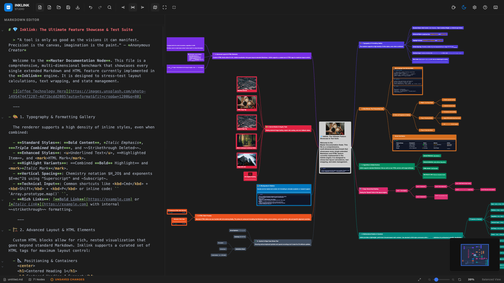
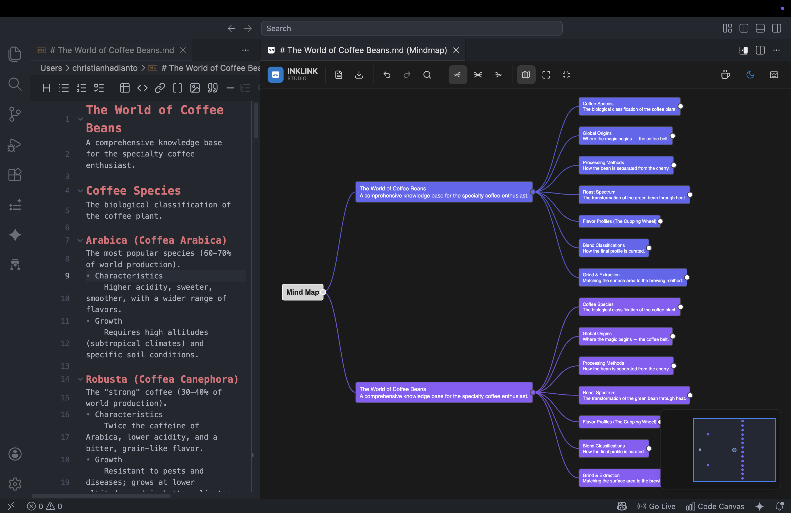

# Inklink


[](https://marketplace.visualstudio.com/items?itemName=ChrisHadi.inklink)
[](https://open-vsx.org/extension/ChrisHadi/inklink)
[](https://buymeacoffee.com/christianh5)

> **Visualize your thinking. Navigate your knowledge. All in Markdown.**

---

## Stop Struggling to See the Big Picture

You've been there. A 500-line markdown document. You wrote it three weeks ago. Now you need to find that one decision you made about authentication flow. Good luck scrolling.

**Here's the truth:** Markdown is the world's standard for technical documentation. But it's designed for writing, not reading. The hierarchical structure that makes it powerful? It's invisible when you're trying to navigate.

**Inklink makes it visible.**

---

## What is Inklink?

Inklink transforms any Markdown document into an interactive mind map — instantly, automatically, with zero setup.

- No import dialogs
- No special syntax
- No learning curve

Just open your `.md` file and see your document's structure come alive. Headings become branches. List items become leaves. Your entire document becomes a navigable, visual tree.

**Write on the left. Think on the right.**



---

## Why Developers Love Inklink

### 🔗 Navigate Instantly
Click any node to jump to its source line. Double-click to highlight. The connection between your text and your visual map is always bidirectional and live.

### 📊 See the Structure
Complex documents become scannable at a glance. Perfect for PRDs, RFCs, ADRs, and any markdown file where hierarchy matters.

### ⚡ Real-Time Updates
Type in the editor, watch the map update. Inklink keeps pace with your thinking — not just after you save, but as you type.

### 📱 Works Everywhere
From desktop to mobile. Inklink adapts to any screen size while maintaining the same powerful interactions.

### 🛡️ Never Lose Work
Auto-save to local storage means your mind map state survives crashes, refreshes, and accidental closes. Just reopen and pick up where you left off.

---

## Key Features

### Real-Time Mind Map
Every heading and list item automatically becomes a node. Changes appear instantly as you type.

### Bidirectional Navigation
Double-click any node to jump to its source line. Click in the editor and the map follows. Always in sync.

### Interactive Note Blocks
Code blocks and quotes expand directly on nodes. Toggle them with a click. State persists as you edit.

### Rich Media Support
Images render as thumbnails on nodes. Click for a fullscreen lightbox. Tables become interactive elements.

### Multiple Layouts
Choose balanced (two-sided), left-to-right, or right-to-left layouts. All with perfect node distribution.

### Professional Minimap
Navigate massive documents without getting lost. The minimap keeps your "neighborhood" in focus even with 1000+ nodes.

### Export Anywhere
PNG, SVG, or interactive HTML. Share your visual thinking with anyone — they don't need Inklink to view it.

### Dark Mode Native
Color-coded branches that look great in both light and dark modes. VS Code integration that feels native.

---

## Who is it for?

- **Developers** writing specs, RFCs, and ADRs who need to present or review structure quickly
- **Product Managers** organizing requirements who want to see coverage at a glance
- **Technical Writers** managing large docs who need navigation without context loss
- **AI Engineers** building prompts who need to reason about complex instruction structures
- **Anyone** whose markdown has grown beyond what they can mentally map

---

## VS Code Extension

Inklink lives inside your editor. No tab switching. No context loss. Just your code and your mind map, side by side.



The extension is designed to feel native:
- Compact toolbar optimized for IDE real estate
- Dark background matching VS Code
- File and web links route to the right place
- Standard VS Code shortcuts work normally

---

## Getting Started

```bash
git clone https://github.com/lalulali/inklink.git
cd inklink
npm install
npm run dev
```

Open [http://localhost:3000](http://localhost:3000) and drop in any markdown file.

### VS Code Extension

```bash
cd vscode-extension
npm install
npm run build
```

Install the `.vsix` via **Extensions > Install from VSIX...** in VS Code.

---

## How It Works

Inklink parses your markdown's heading hierarchy (`#`, `##`, `###`, ...) and list indentation into a tree structure, then renders it as an SVG mind map using D3.js.

```markdown
# Product Vision

## Core Features
- Editor
    WYSIWYG for seamless writing
- Visualization
    real-time mind map as you type

## Design
### Typography
### Color System
    primary, secondary, semantic tokens

## Roadmap
### MVP
- Core editor
- Mind map renderer
- Export to SVG
```

This renders as a branching mind map rooted at **Product Vision**, with each heading as a branch and each list item as a leaf node.

---

## Keyboard Shortcuts

### Global (Web)

| Shortcut | Action |
|---|---|
| `Cmd/Ctrl + O` | Open file |
| `Cmd/Ctrl + S` | Save file |
| `Cmd/Ctrl + F` | Find on canvas |
| `Cmd/Ctrl + Shift + F` | Find in editor |
| `Cmd/Ctrl + Shift + H` | Find & replace |
| `Cmd/Ctrl + Z` | Undo |
| `Cmd/Ctrl + Shift + Z` | Redo |
| `Cmd/Ctrl + E` | Export dialog |
| `?` | Shortcuts drawer |

### Canvas

| Shortcut | Action |
|---|---|
| `E` | Toggle editor |
| `X` | Expand nodes |
| `C` | Collapse nodes |
| `Enter` | Toggle selected node |
| `F` | Fit to screen |
| `R` | Reset zoom |
| `M` | Toggle minimap |
| `Escape` | Deselect |
| `Arrow keys` | Navigate nodes |
| `Scroll` | Pan |
| `Alt/Cmd + Scroll` | Zoom |

---

## Technology Stack

| Layer | Technology |
|---|---|
| Framework | Next.js 16 with App Router |
| Language | TypeScript (strict mode) |
| Rendering | D3.js (SVG-based) |
| Styling | Tailwind CSS + shadcn/ui |
| VS Code | Extension API + Webview |
| Testing | Jest + fast-check |

---

## License

MIT — see [LICENSE](./LICENSE) for details.

---

## Support

If Inklink has saved you time, consider [buying me a coffee](https://buymeacoffee.com/christianh5).

---

**Inklink** — *Visualize your thinking. Navigate your knowledge. All in Markdown.*