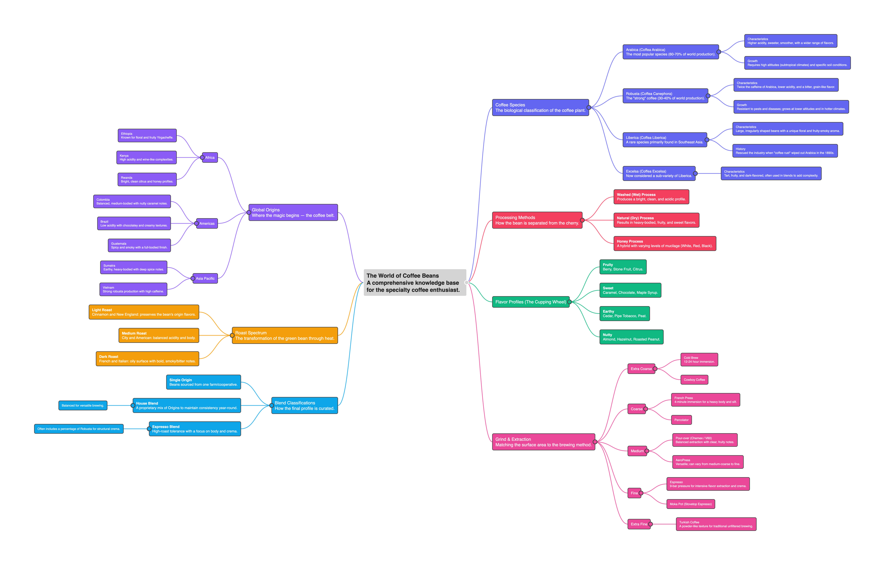

# Inklink


[](https://marketplace.visualstudio.com/items?itemName=ChrisHadi.inklink)
[](https://open-vsx.org/extension/ChrisHadi/inklink)
[](https://buymeacoffee.com/christianh5)

> **Visualize your thinking. Navigate your knowledge. All in Markdown.**

---

## The Problem

*"Markdown is the new hot coding language. Deal with it."*
— [InfoWorld, March 2026](https://www.infoworld.com/article/4146579/markdown-is-now-a-first-class-coding-language-deal-with-it.html)

Markdown is everywhere. It is how developers write specs, how teams collaborate on requirements, how AI agents receive instructions, and how knowledge gets shared. It has quietly become the lingua franca of the modern technical world — not just a formatting tool, but a **first-class language for structuring thought**.

Yet the tooling has not caught up.

You write a 300-line document and **lose the structure**. You share a markdown file and your collaborator has to read every line to understand the hierarchy. You use AI to generate specs in markdown and have no quick way to comprehend the shape of the output.

**The gap is not in writing markdown — it is in reading and navigating it.**

Inklink exists to close that gap.

---

## What is Inklink?

Inklink is a **markdown-to-mind-map visualizer** built for the way we think and work today. It takes any markdown document — a spec, a plan, an outline, a set of AI instructions — and instantly renders it as an interactive, navigable mind map.

There is no conversion step. No import format. No special syntax to learn. Just write markdown the way you always have, and Inklink gives you a living, visual representation of its structure in real time.

**Write on the left. Think on the right.**


And now, with the **VS Code extension**, you can think right inside your editor — without breaking your flow.

---

## Who is it for?

- **Developers** who use markdown as the primary medium for specs, RFCs, and ADRs and want to quickly grasp or present their structure
- **Product managers** who outline requirements in markdown and need a faster way to review hierarchy and coverage
- **Technical writers** who maintain large documentation trees and need to navigate them without losing context
- **AI practitioners** who work with markdown-heavy workflows, prompts, and system instructions and need to reason about their shape
- **Anyone** who thinks better visually and has always found markdown indentation a bit hard to scan at a glance

---

## Core Features

### 🗺️ Real-Time Markdown Mind Map
Every heading (`#`, `##`, `###`) and list item in your Markdown automatically becomes a node in the mind map. Edit the file — the map updates instantly. **Version 0.2.0** features **Precision Navigation** and **Zero-Jitter Synchronization**, eliminating all visual shifting while providing a high-fidelity "Neighborhood" view for even the largest documents.

### 🔗 Bidirectional Navigation
**Double-click any node** to jump directly to the corresponding source line in the editor, temporarily highlighting the text. The connection between visual and text is always live — edit the markdown, the map updates; navigate the map, the editor follows. **Version 0.2.0** includes throttled, lag-free synchronization for extremely large files (1000+ nodes).

### 📝 Interactive Markdown Note Blocks
Inklink identifies **Code Blocks** and **Quote Blocks** within your markdown and renders them as interactive, expandable elements directly on the mind map nodes.
- **Collapsed View**: Blocks appear as clean, tonal-relief "pills" indicating the type and line count.
- **Expanded View**: Blocks expand into full-width integrated containers with syntax labeling and italicized quotes.
- **Micro-interactions**: Toggle any block by clicking its header or the pill. All labels, carets, and counts are vertically centered with **Perfectly Balanced Padding** for a premium, well-balanced look.
- **Dynamic Layout**: Mind map nodes automatically adjust their vertical distance and re-flow to accommodate expanded or collapsed blocks, ensuring the layout remains clean and readable without overlaps.
- **State Persistence**: Interactive blocks maintain their expanded/collapsed state during live markdown edits, allowing for a seamless transitions between writing and thinking.
- **Indentation Fidelity**: Uses `white-space: pre` to faithfully preserve complex indentation structures (tabs and spaces) inside code and quote blocks, ensuring technical snippets remain readable and accurate.
- **Stitch Design System**: Adheres to a borderless, tonal-relief aesthetic with 6px rounded corners, ensuring blocks feel like a natural extension of the node.

### 🖼️ Interactive Multimedia
Inklink renders **Markdown Images** directly on your mind map nodes, turning plain documentation into a rich visual reference.
- **Thumbnail Previews**: Images are rendered as aspect-aware thumbnails with smart scaling, integrated seamlessly into the node structure.
- **Fullscreen Lightbox**: Click any image to open a high-fidelity lightbox with center-zoom animations, backdrop-blur effects, and full-resolution viewing.
- **Linked Image Integration**: Images wrapped in links are intelligently detected, allowing you to open the original URL directly from the lightbox view.

### 📊 Interactive Tables
Structured data is no longer hidden in text. Inklink identifies **Markdown Tables** and renders them as interactive integrated nodes.
- **Column Synchronization**: Table columns are automatically distributed across the node width with robust overflow handling.
- **Visual Consistency**: Tables adhere to the "Stitch" design language with tonal-relief row highlighting and consistent alignment.

### 🧭 Multiple Layout Directions & Physics
Choose how your map flows: balanced two-sided, left-to-right, or right-to-left. 
- **Strict Parity**: The **Two-Sided (Balanced)** layout features a height-aware distribution algorithm that ensures perfect node parity between left and right branches (max difference of 1).
- **Panning Constraints**: Inklink now enforces flexible workspace bounds with a 200px buffer, ensuring you always stay oriented within your "Neighborhood" and preventing the map from getting lost in infinite space.

| Balanced | Left to Right | Right to Left |
|:---:|:---:|:---:|
|  |  |  |

### 🔭 Lighthouse Minimap v2: "Navigate Your Knowledge"
A professional-grade **navigation minimap** in the bottom-right corner designed for deep-document navigation.
- **Intelligent Auto-Focus**: The minimap no longer shows just a tiny star-chart. It maintains a high-resolution "Neighborhood" focus around your viewport, providing clear branch visibility even in 1000+ node maps.
- **Power Zoom (The Fly-Over)**: Dragging the viewport rectangle instantly and smoothly zooms out to a Global Overview, allowing you to "fly" across branches and "dive" back into local detail upon release.
- **Structural Skeleton**: A branching skeleton layer preserves structural context at all zoom levels.
- **Hierarchical Pills**: Nodes are rendered as depth-aware rounded pills. Root and Level-1 nodes are visually weighted so the "spine" of your document is always unmistakable.

### 🔍 Professional Search & Replace
A VS Code-style find and replace panel with full keyboard shortcuts (`Cmd+Shift+F` / `Cmd+Shift+H`), overlapping match support, regex, match-case, whole-word, and preserve-case modes.

### 🗂️ File-First Workflow
Open any `.md` file directly from the filesystem. Save changes back in place. Drag-and-drop a file onto the canvas to open it instantly — no dialog required. Inklink uses the modern **File System Access API** for a seamless local-first experience.

### 🛡️ Local-First Data Safety
Your work is never lost. Inklink continuously saves snapshots to **IndexedDB** in the background. If you close the tab, refresh, or crash, the **Recovery Center** detects your previous sessions on next launch and lets you browse, preview, and restore any of them — individually (with a quick **double-click**) or all at once.

### ⚙️ Configurable Settings
Tune the experience to match your workflow:
- **Maintenance Center** — a dedicated panel to manage local synchronization and data cleanup policy
- **Continuous File Sync** — automatically write changes back to the opened file every 30 seconds
- **Automatic Cleanup** — set how many days to keep local recovery snapshots before they are automatically purged (1–90 days)
- **Snapshot Management** — review and manually purge all local snapshots from the settings panel at any time

### 📤 Export Options
Export your mind map as SVG, PNG, or a standalone interactive HTML file — ready to embed in any documentation or share with stakeholders who do not have Inklink.

### 📦 Full Undo / Redo
50-step history with standard keyboard shortcuts. Change your mind as many times as you need.

### 🌗 Dark & Light Mode
Theme-aware rendering with color-coded branch hierarchies. Connectors now maintain their vibrant light-mode colors even in dark mode, providing a consistent visual identity across themes.

### 🎨 Solarized Monochromatic Theme
A state-of-the-art "Solarized" link coloring system. Instead of clashing colors, links use the same hue as the node background but with optimized, high-vibrancy "Neon" saturation and lightness thresholds. This ensures extreme legibility while reducing eye strain and visual clutter on saturated nodes (Magenta, Purple, Blue).

### 🖼️ Interactive Image Support
Experience your visual assets directly on the mind map. Inklink parses standard markdown image syntax — `` and `[](link)` — and renders them as professional thumbnails integrated within your nodes.
- **Strict Parsing**: Improved reliability with a strict `!` requirement for accurate differentiation from standard links.
- **Aspect-Aware Resizing**: Images are automatically scaled to fit within nodes while strictly preserving their original aspect ratio.
- **Interactive Lightbox**: Click any image to open a fullscreen lightbox with center-zoom animations.
- **Linked Image Integration**: Images wrapped in links feature functional "Open Link" handlers within the lightbox preview.
- **Link Normalization**: Built-in logic ensures external URLs are correctly handled as absolute links.
- **Seamless Node Flow**: Nodes automatically expand vertically to accommodate images, with thumbnails positioned at the top and text content flowing naturally below.

### 📱 Mobile Responsive
A fully adaptive layout — persistent inline editor, mobile-optimized quick-action toolbar, and touch-friendly side drawers — so the tool remains powerful even on small screens.

### ✨ Visual Excellence
A professional, high-end **Solid Flat Design System**:
- **Modern Overlays** — side-sheet drawers and dialogs now feature **persistent headers** with integrated close controls and `backdrop-blur` foundations
- **Clean Aesthetic** — zero glassmorphism and zero translucency on primary UI elements for maximum contrast and readability
- **Standardized UI** — a cohesive design language across all overlays, from the recovery center to the keyboard shortcut reference
- **Living Response** — micro-animations and hover-reactive elements (like the expanding scrollbars) make the interface feel alive and premium

---

## VS Code Extension

Inklink is available as a **VS Code extension**, bringing the same mind map experience directly into your editor panel — no browser required.


### Platform-Aware Design
The extension is not just a web view in a frame. It is a first-class VS Code experience:
- **Compact toolbar** — scaled down to conserve precious screen real estate inside the IDE
- **Deep dark background** — integrates naturally with VS Code's dark theme palette
- **Hidden redundant shortcuts** — open, save, search, and replace are handled natively by VS Code; the Inklink toolbar surfaces only what the IDE cannot provide
- **Shared design tokens** — despite the compact layout, the color palette, node shapes, and typography remain pixel-perfect with the web version
- **Context-Aware Link Navigation** — Clicked links intelligently route based on type: local file links open in your primary editor area (preserving the mind map side-by-side), while web links trigger your default system browser.

### Installing the Extension
The extension is built from the `vscode-extension/` directory in this repository. To build and install locally:

```bash
cd vscode-extension
npm install
npm run build
```

Then install the generated `.vsix` package via **Extensions > Install from VSIX...** in VS Code.

---

## Quick Start

### Prerequisites
- Node.js 18+
- npm

### Installation

```bash
git clone https://github.com/lalulali/inklink.git
cd inklink
npm install
npm run dev
```

Then open [http://localhost:3000](http://localhost:3000).

### Build for Production

```bash
npm run build
npm start
```

### Run Tests

```bash
npm test
```

---

## How it Works

Paste or type any markdown document into the editor panel. Inklink parses the heading hierarchy (`#`, `##`, `###`, ...) and list indentation (spaces or tabs) into a tree structure, which D3.js renders as an SVG mind map in real time.

The format is flexible — you can mix heading levels and bullet lists freely, and add descriptive notes on the next indented line to annotate any node:

```markdown
# Product Vision

## Core Features

- Editor
    use WYSIWYG editor for a seamless writing experience
- Visualization
    real-time mind map rendering as you type

## Design

### Typography
### Color System
    primary, secondary, and semantic tokens

## Roadmap

### MVP
- Core editor
- Mind map renderer
- Export to SVG

### v1.0
- Collaborative editing
- Plugin system
```

Inklink renders this as a branching mind map rooted at **Product Vision**. Each heading becomes a branch, each list item becomes a leaf node, and indented lines beneath a node appear as its descriptive label — giving you full control over both structure and context without leaving your markdown.

---

## Keyboard Shortcuts

### 🌐 Global (Web only)

| Shortcut | Action |
|---|---|
| `Cmd/Ctrl + O` | Open file |
| `Cmd/Ctrl + S` | Save file |
| `Cmd/Ctrl + F` | Find node on canvas |
| `Cmd/Ctrl + Shift + F` | Find in editor |
| `Cmd/Ctrl + Shift + H` | Find & replace in editor |
| `Cmd/Ctrl + Z` | Undo |
| `Cmd/Ctrl + Shift + Z` | Redo |
| `Cmd/Ctrl + E` | Open export dialog |
| `?` | Open keyboard shortcuts drawer |

> **VS Code note:** Open, save, search, and replace are handled natively by VS Code. The Inklink toolbar in the extension only surfaces canvas-level and view-level actions.

### 🗺️ Canvas

| Shortcut | Action |
|---|---|
| `E` | Toggle editor panel |
| `X` | Expand selected node (or all) |
| `C` | Collapse selected node (or all) |
| `Enter` | Toggle collapse on selected node |
| `F` | Fit map to screen |
| `R` | Reset zoom to 100% |
| `M` | Toggle minimap |
| `Escape` | Deselect node / close canvas search |
| `Cmd/Ctrl + ←` | Switch to right-to-left layout |
| `Cmd/Ctrl + →` | Switch to left-to-right layout |
| `Cmd/Ctrl + ↑ / ↓` | Switch to two-sided layout |
| `Arrow keys` *(node selected)* | Navigate between nodes |
| `Scroll` | Pan canvas |
| `Alt/Cmd + Scroll` | Zoom in / out |

### ✏️ Editor

| Shortcut | Action |
|---|---|
| `Cmd/Ctrl + B` | Toggle **bold** on selection |
| `Cmd/Ctrl + I` | Toggle *italic* on selection |
| `Cmd/Ctrl + Shift + X` | Toggle ~~strikethrough~~ on selection |
| `Enter` | Continue list / auto-indent |
| `Shift + Enter` | Add note line under current item |
| `Tab` | Indent list item |
| `Backspace` | Smart dedent on list items |

---

## Technology Stack

| Layer | Technology |
|---|---|
| Framework | Next.js 16 with App Router |
| Language | TypeScript (strict mode) |
| Rendering | D3.js (SVG-based) |
| Styling | Tailwind CSS + shadcn/ui |
| VS Code Integration | VS Code Extension API + Webview |
| Testing | Jest + fast-check (property-based) |

---

## Inspiration & References

This project was inspired by [Markmap](https://github.com/markmap/markmap), which was studied as a reference implementation for D3.js rendering patterns, pan/zoom interaction, and SVG export techniques. Inklink's markdown parser, layout algorithms, state management, and file operations are fully custom implementations.

---

## Support

If Inklink has saved you time or helped you think more clearly, consider buying me a coffee. It keeps the project alive and motivates continued development.

[](https://buymeacoffee.com/christianh5)

---

## License

MIT — see [LICENSE](./LICENSE) for details.

---

## Acknowledgments

- [Markmap](https://github.com/markmap/markmap) — For D3.js rendering patterns and inspiration
- [D3.js](https://d3js.org/) — For SVG visualization
- [shadcn/ui](https://ui.shadcn.com/) — For component patterns
- [InfoWorld](https://www.infoworld.com/article/4146579/markdown-is-now-a-first-class-coding-language-deal-with-it.html) — For articulating what the developer community already knows: Markdown is a first-class language, and the tools should treat it that way